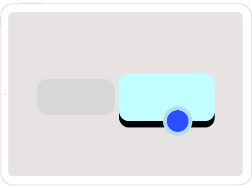

<p align="center">
  
  <h1 align="center">React Native Pointer Interactions</h1>
  <h3 align="center">Expose iPad mouse & track pads interactions to React Native.</h3>
</p>

<p align="center">
  <a href="https://www.npmjs.com/package/@thefunbots/react-native-pointer-interactions">
  </a>
  <a href="https://www.npmjs.com/package/@thefunbots/react-native-pointer-interactions"></a>
  <a href="https://www.codacy.com/gh/thefunbots/react-native-pointer-interactions"></a>
</p>

---

Expose iPad mouse & track pads interactions to React Native

Ref: https://developer.apple.com/design/human-interface-guidelines/ios/user-interaction/pointers/


## Getting started

### Mostly automatic installation

**1. Install the library**

```bash
npm install @thefunbots/react-native-pointer-interactions --save
```

**2. (Optional) Install react-native-swift**

If you are not already using any other swift based modules in your app, install and run react-native-swift to configure your iOS project to support swift.

### Install react-native-swift

```bash
npm install --save react-native-swift
```

After installing it, you will need to link it. **Requires project to use Swift 5.0 and iOS SDK 13.4+**

### Manual installation

#### iOS

1. In XCode, in the project navigator, right click `Libraries` ➜ `Add Files to [your project's name]`
2. Go to `node_modules` ➜ `react-native-pointer-interactions` and add `RNPointerInteractions.xcodeproj`
3. In XCode, in the project navigator, select your project. Add `libRNPointerInteractions.a` to your project's `Build Phases` ➜ `Link Binary With Libraries`
4. Run your project (`Cmd+R`)<

## Setup

Add this to the Info plists

```xml
<key>UIApplicationSupportsIndirectInputEvents</key>
<true/>
```

## Usage

### Basic usage

Wrap the views you want to be interactable in `PointerInteractionView`

```jsx
import { PointerInteractionView } from '@thefunbots/react-native-pointer-interactions';

<PointerInteractionView pointerMode="lift">
  <Text>Hi</Text>
</PointerInteractionView>
```

### Using the High Order Component

Soon

### Props

The component extends the regular View, so you can use the common properties too.

| Prop        | Description                                                                   |
|-------------|-------------------------------------------------------------------------------|
| pointerMode | [`automatic`, `lift`, `highlight`, `hover`, `verticalBeam`, `horizontalBeam`] |

## Examples

If you want to play with the API but don't feel like trying it on a real app, you can run the example project. Clone the repo, go to the `example/` folder and run:

```bash
npm install
```

If you are running on ios, run `pod install` in the ios folder

Run `react-native start` to start the metro bundler

Run `react-native run-ios` (depending on which platform you want to run the example app on).

You will need to have an iOS device or emulator connected as well as `react-native-cli` package installed globally.

## Troubleshooting

- It doesn't work when wrapping `react-native-gesture-handler` buttons